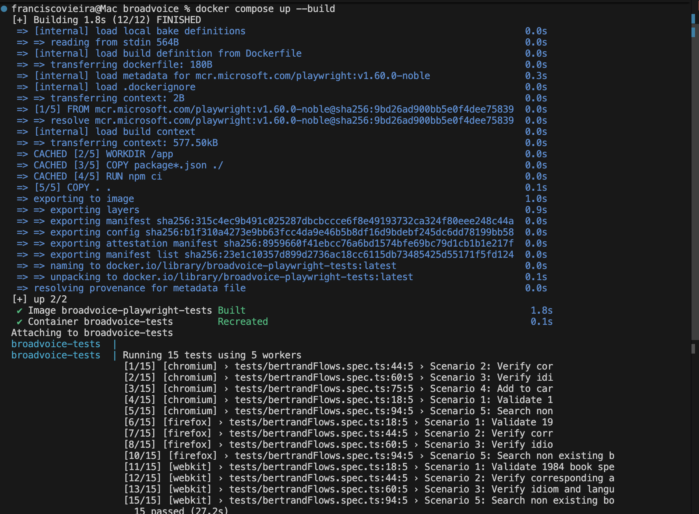
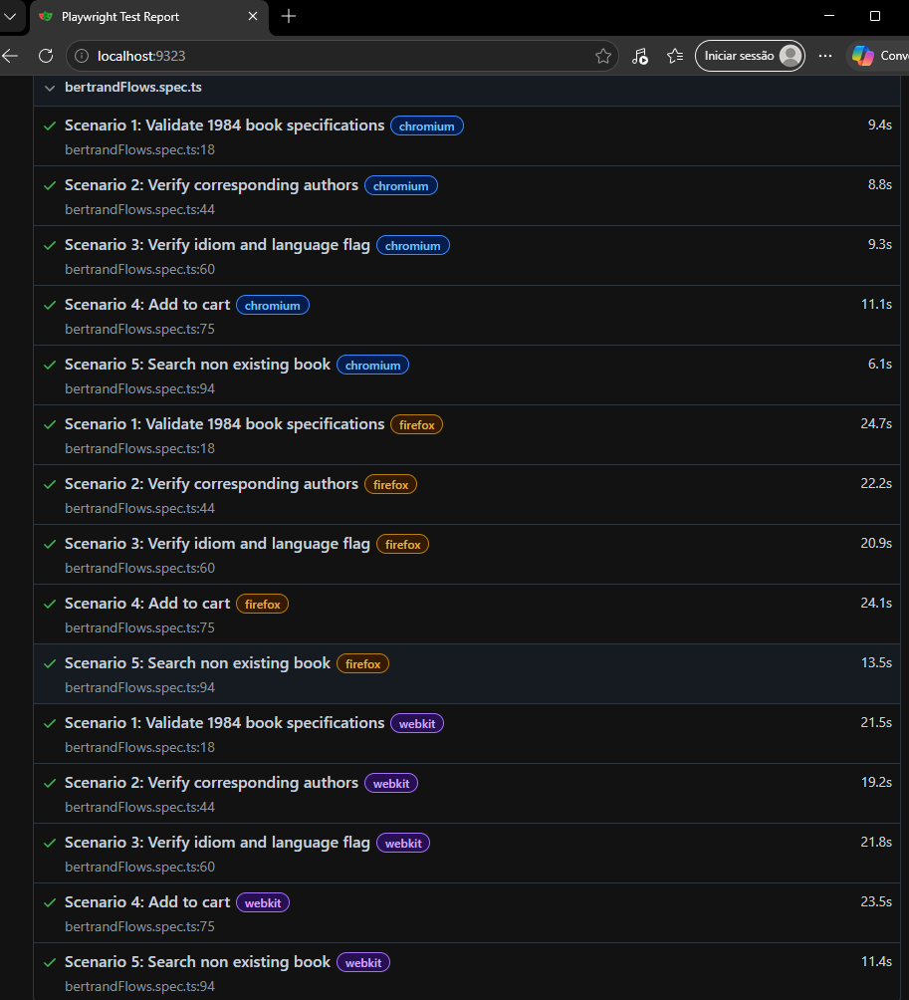

# 🎭 Bertrand Test Automation 🎭

This repository contains a few automation scenarios for the Bertrand website (bertrand.pt). The project is built using Playwright with TypeScript.

The automation suite validates critical user flows such as searching for books, checking product specifications (Author, ISBN, Dimensions, Page Count, Language), and the add-to-cart functionality.

📘 Project structure:
```text
broadvoice/
├── pages/
│   ├── BookDetailsPage.ts    # Locators and validation for product details
│   └── HomePage.ts           # Locators and methods for main page/search
└── tests/
    ├── bertrandFlows.spec.ts # Scenarios 1,2,3,4,5
    └── utils.ts              # Utility functions (cookies)
```

## <a name="docker-run"></a>🐳 Running with Docker 🐳

> 💡 **[Click here if you don't use Docker](#local-install)**

I include docker and docker-compose files for easy execution.

### Prerequisites
- Docker must be installed and running on your machine.

### How to Run 🚀

1. Build and run the test suite:
```bash
docker compose up --build
```

2. Once the execution completes, the HTML report will be generated in:
`./playwright-report/index.html` (you can view it in your browser by opening this file).

<a href="./assets/docker.png" target="_blank"></a>
<a href="./assets/pwTests.png" target="_blank"></a>

---

## <a name="local-install"></a>Alternative: Local Installation & Run 🚀


### Installation

1. Install project dependencies:
```bash
npm install
```

2. Install Playwright browsers:
```bash
npx playwright install
```

### Running Tests

Execute the tests using the Playwright CLI:

**Run in Headless Mode:**
```bash
npx playwright test
```

**Run in UI Mode:**
```bash
npx playwright test --ui
```

**View HTML Report:**
```bash
npx playwright show-report
```
